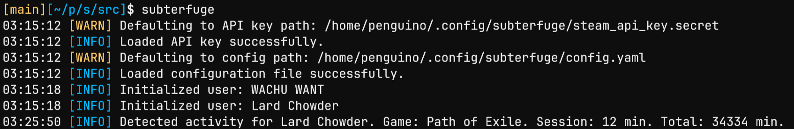

# Subterfuge

 

Reports updates in Steam user activity.

🦀 written in Rust

## Why Subterfuge?

Subterfuge was born from the special characteristics of Steam's "invisible" online presence.

This mode allows you to play games online while appearing offline to others on Steam. However, this does not prevent your playtime history from being updated while you play games in secret.

Subterfuge automates the operation of evaluating Steam activity despite online status.

## How it works

Subterfuge leverages the [Steam Web API](https://steamcommunity.com/dev) to report live changes in user playtime history. User playtime is updated:

1. Every 30 minutes of a game session, and
2. On terminating a game session.

Users are defined by Steam ID in a [configuration file](#configuration). There are a few ways to find a user's SteamID:

+ [Steam Support — "How can I find my SteamID?"](https://help.steampowered.com/en/faqs/view/2816-BE67-5B69-0FEC)
+ Third party sites
  + [steamidfinder](https://www.steamidfinder.com/) (I like this one)
  + [steamid.io](https://steamid.io/)

## Building and running

To manually build the project, you must first [install Rust](https://www.rust-lang.org/tools/install).

Once you have Rust installed, run the following commands:

```bash
git clone https://github.com/massivebird/subterfuge
cd subterfuge

cargo run # runs unoptimized build
cargo run -- <args> # unoptimized build with optional subterfuge arguments
```

### NixOS

If you are on NixOS, run the following in order to download subterfuge's dependencies:

```bash
cd subterfuge
nix develop # build a new shell with subterfuge's dependencies

# you can now build and run like usual
cargo run
```

### Adding subterfuge to your PATH

If you want to add subterfuge to your PATH, I recommend building it in release mode for better optimization.

```bash
cd subterfuge
# build release mode
cargo build --release
# add subterfuge to your PATH
ln -rs ./target/release/subterfuge <dir-in-PATH>/subterfuge
# subterfuge is now available as a command
subterfuge
```

## Usage

For information on subterfuge's optional arguments and flags, run:

```bash
subterfuge --help
```

## Configuration

Subterfuge is configured with a [YAML](https://en.wikipedia.org/wiki/YAML) file located at:

+ `$HOME/.config/subterfuge/config.yaml` (default), or
+ The path specified by `--config-file <PATH>`, if supplied (optional).

Subterfuge expects the following structure inside the configuration file:

```yaml
users: # key under which all users are declared
  first_user: # arbitrary label, can be whatever you want!
    id: 76561198_________ # steam ID
    alias: "The First User" # optional alias that overrides user's profile name
  second_user:
    id: 76561198_________
  # ...
```
